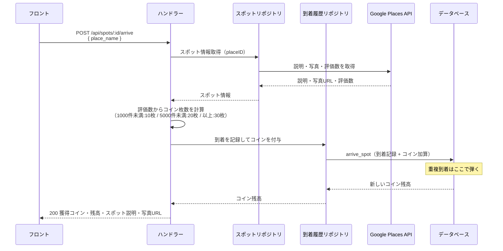
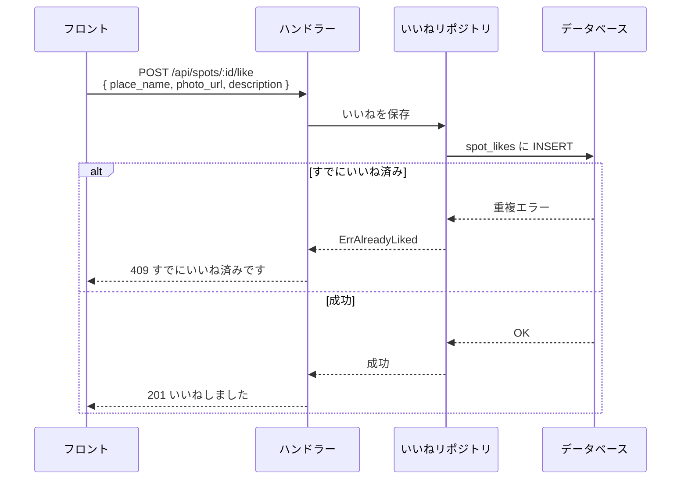
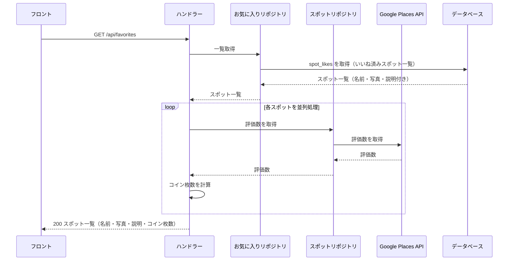
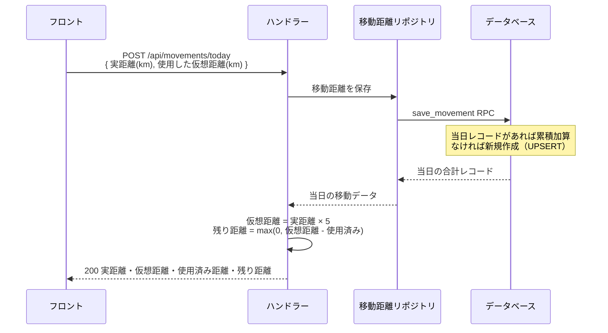
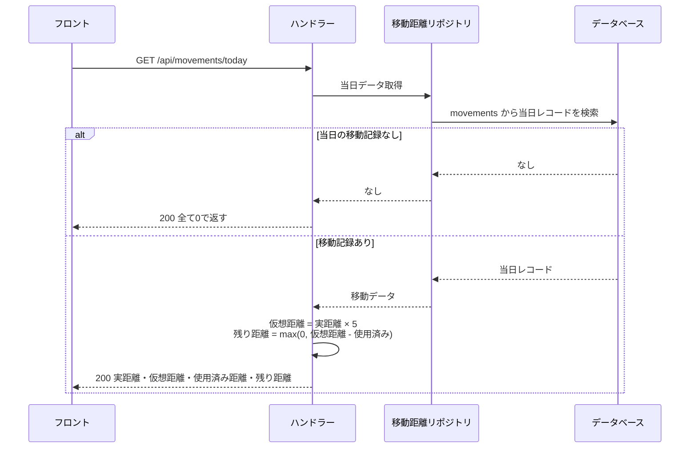
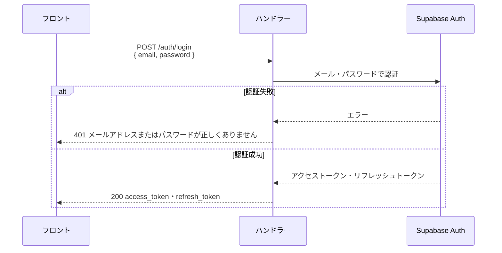

# バックエンド シーケンス図

## スポット到着 `POST /api/spots/:id/arrive`

## いいね `POST /api/spots/:id/like`

## お気に入り一覧 `GET /api/favorites`

## 移動距離保存 `POST /api/movements/today`

## 移動距離取得 `GET /api/movements/today`

## ログイン `POST /auth/login`

